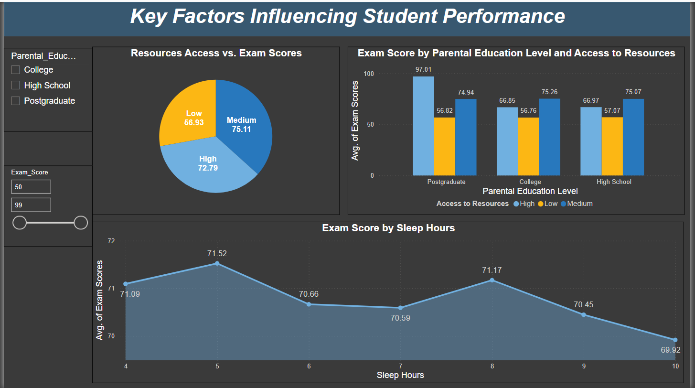
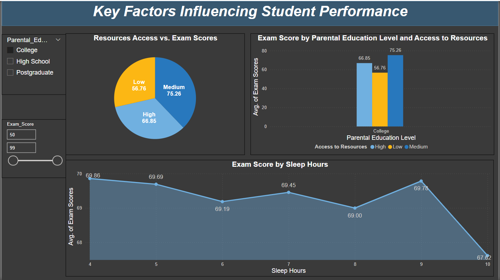
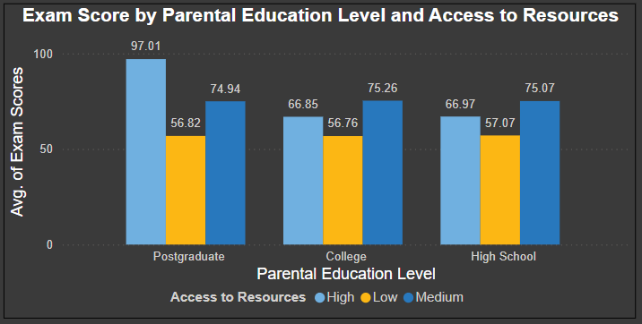
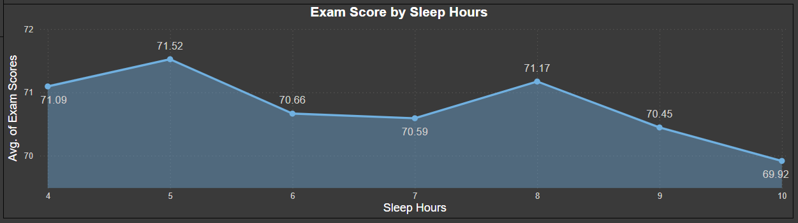

# Students-Performance-Dashboard

An interactive Power BI dashboard analyzing key factors that influence student academic performance — including parental education, access to learning resources, and sleep patterns.

---

## 📊 Dashboard Overview

---

## 🎚️ Dynamic Slicers

Easily filter data by parental education, resource access level, and sleep hours to personalize insights.

---

## 🚀 Features

- **Resources Access vs. Exam Scores**  
  A pie chart showing average scores based on students’ access to learning resources (low, medium, high).
 !(ExamScoreByParentalEduAndAccessToResources.png)

- **Exam Score by Parental Education Level**  
  A bar chart highlighting how parental education levels correlate with student scores and available resources.  
 

- **Exam Score by Sleep Hours**  
  A line graph depicting the relationship between sleep duration and student performance.  
  

---

## 🛠️ Tools Used

- **Power BI**: For building interactive, insightful data visualizations  
- **Data Processing**: Cleaned and prepared data for high-quality analysis

---

## 💡 Key Insights

- Students with **greater access to educational resources** tend to achieve higher exam scores.
- **Parental education level** is a strong influencer of student academic outcomes.
- **Optimal sleep (7–8 hours)** is associated with improved exam performance.

---
